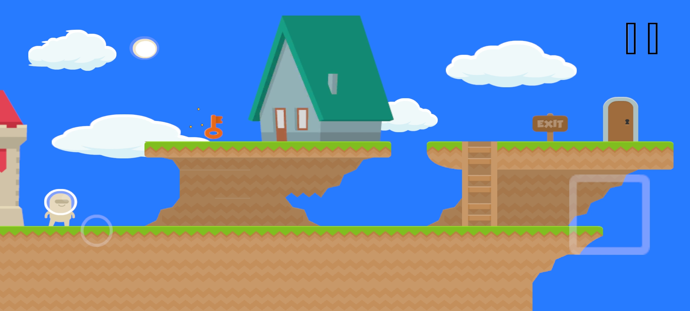
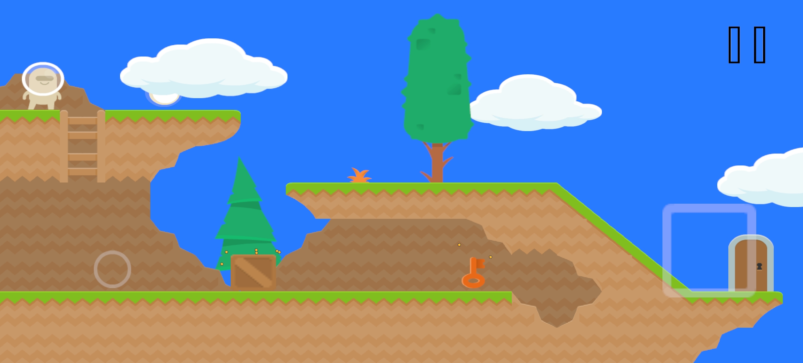

# Platformer

2D платформер с сохранениями прогресса и системой взаимодействий с предметами

## Описание

Игроку нужно пройти 2 уровня, доставляя ключи к дверям. Количество пройденных уровней сохраняется.

## Стек

Unity 6000.2.15f1, new Input System, Zenject, R3, Addressables

## Геймплей

## Уровни

## Билд

[Скачать для Android](https://drive.google.com/file/d/1PaTNMLjIgyk4z5IOZIZkL9rtmahNsMhM/view?usp=sharing)
